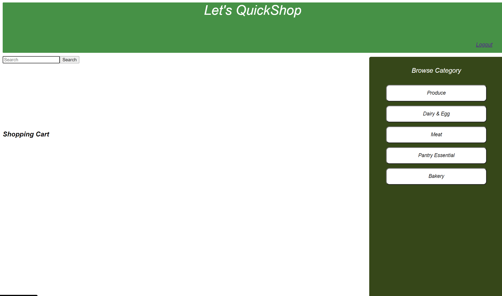
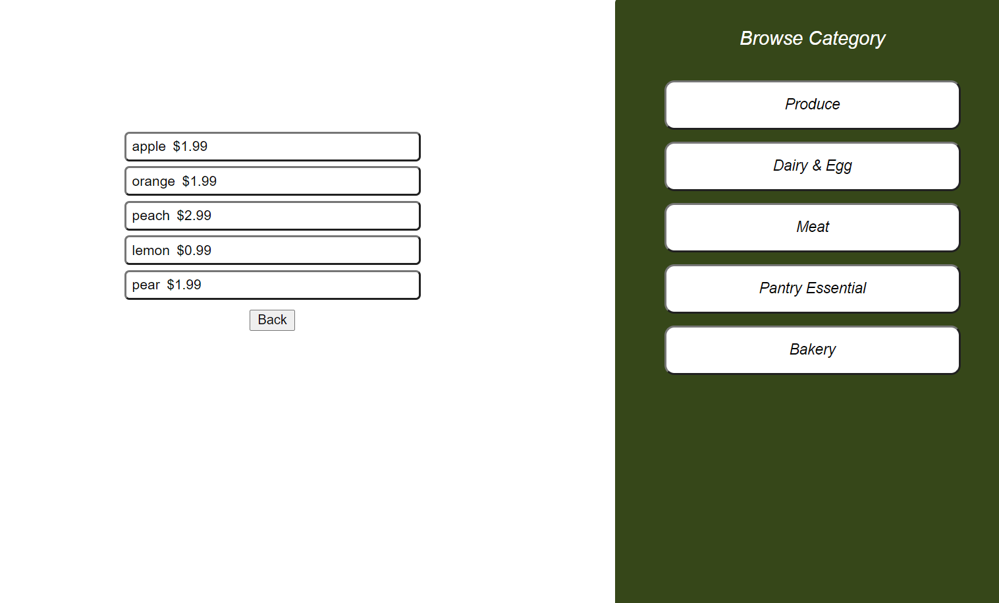
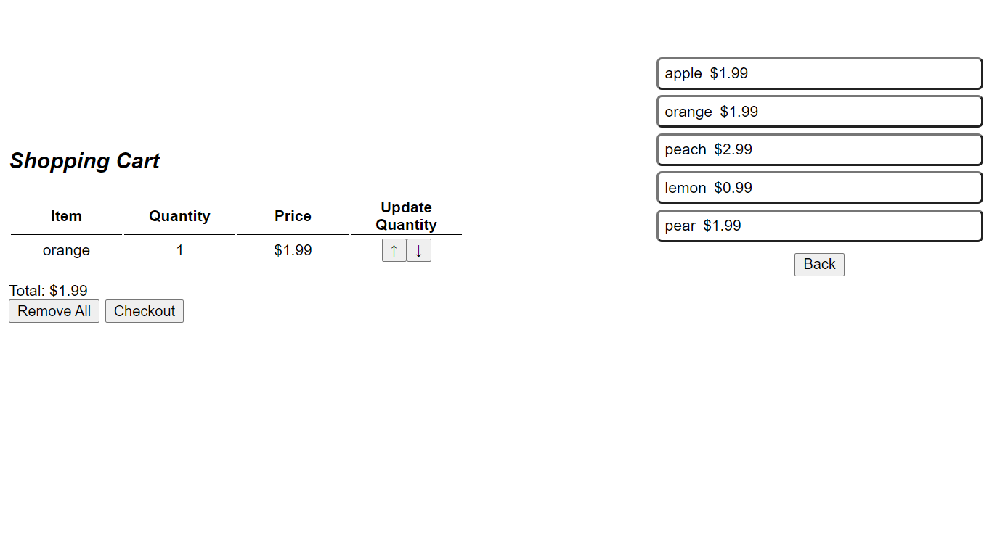
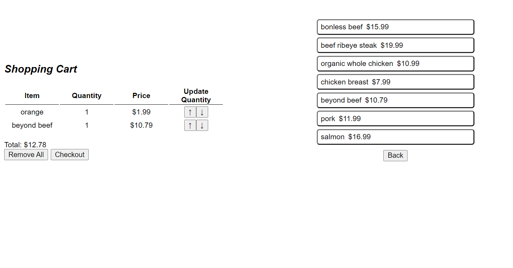
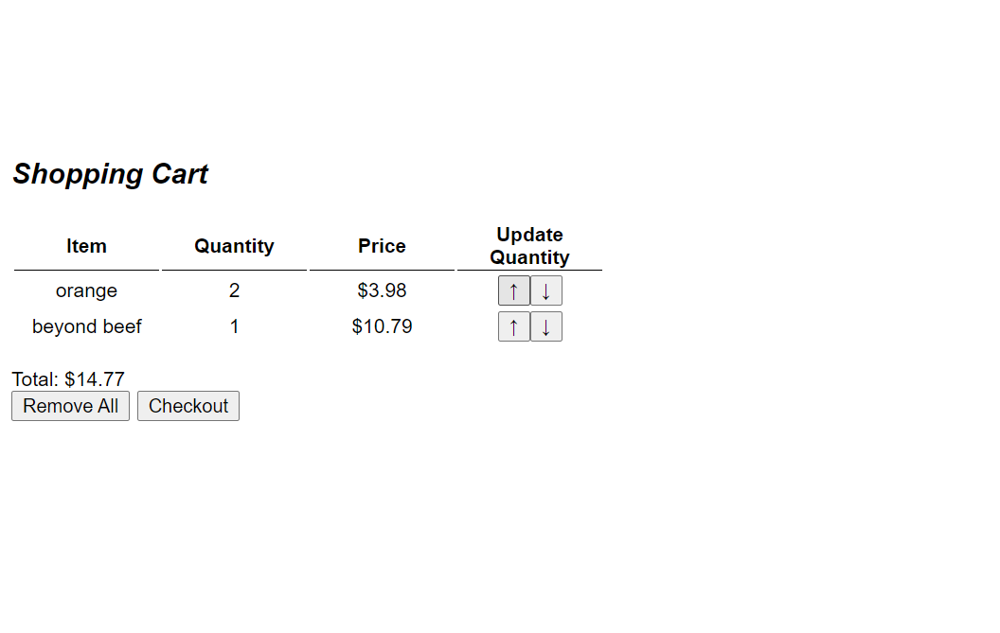
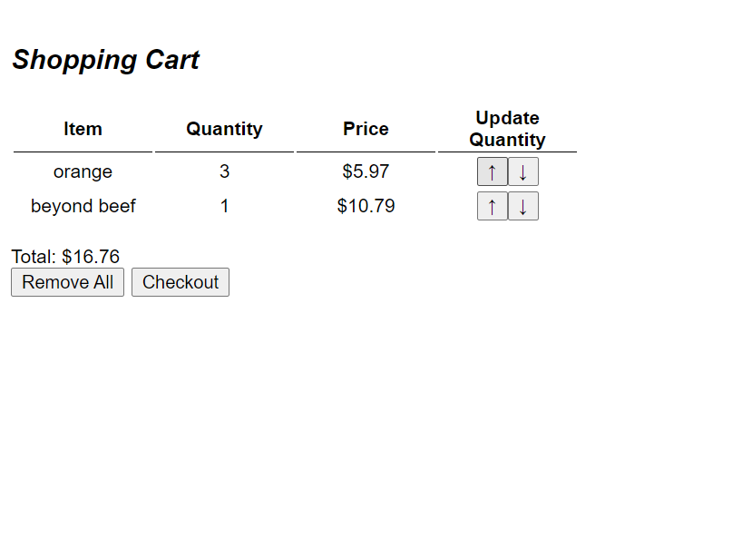
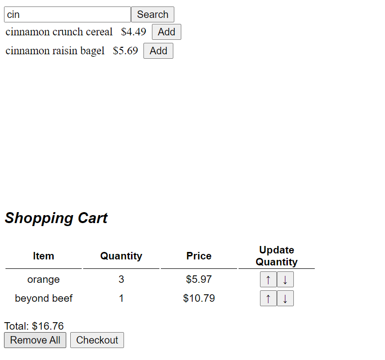
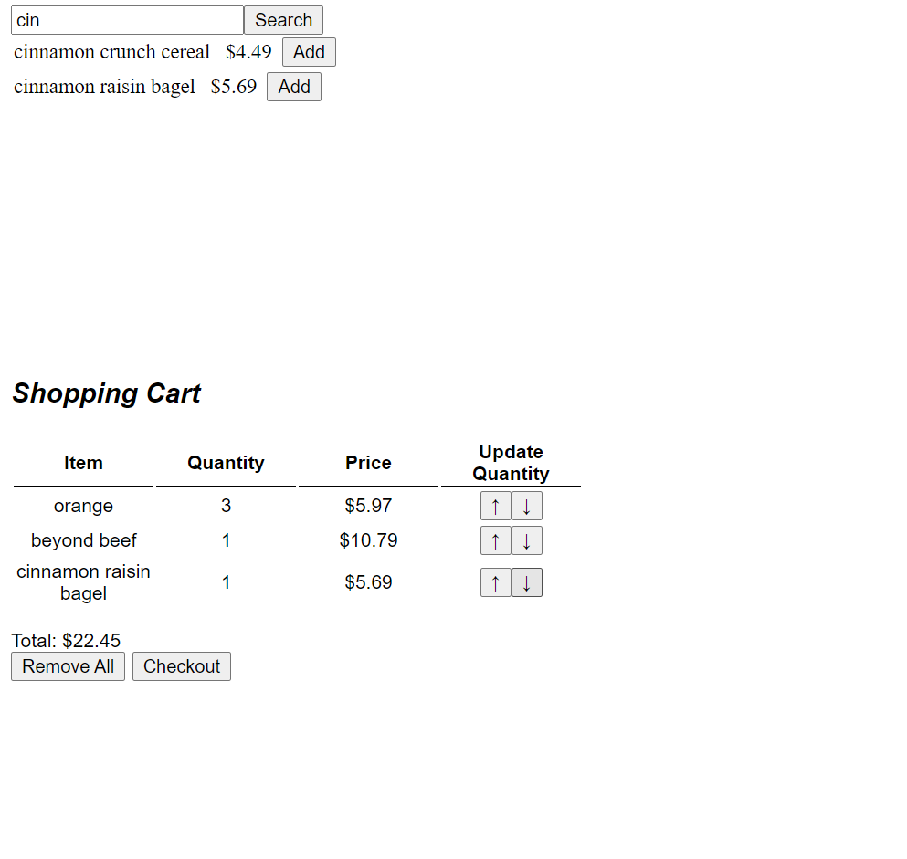
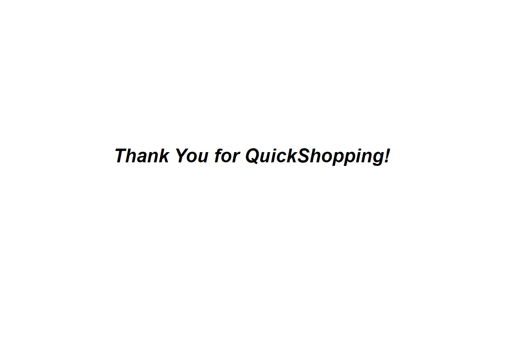

QuickShop

QuickShop is an app that resembles Instacart and lets user do their grocery shopping online. 
It is backed with a server, connected to a MySQL database, and does MySQL quires to retrieve information from the backend.

Home

Main Features:

Categories:
This list allows users to select their shopping category. When the category is selected, the user can browse an item on the list provided.

Items List:
Items list includes the items in the selected category. Picking an item makes it appear in the shopping cart. It also gives the user ability to increase the quantity of the item available in the shopping cart.

Back Button:
Clicking it will clear the items' list from the screen.

Shopping Cart:
Displays the items that the user has chosen. It has the information providing the total of each item and its quantity. It also provides
the increase-decrease buttons, so the user can modify the cart.
At the bottom, it displays the overall cost of the shopping. 
"Remove All" and "Checkout" buttons have the same functionality of emptying the cart.

 

 

Search Bar:
By using the search bar, the user can search for a specific item in their mind, where the search engine will look through all the categories in the database and display items containing the searched word in their title. Additionally, it allows the user to add the item to the shopping cart by pressing the "Add" button.

 

Logout:
This link will exit the user.

 

